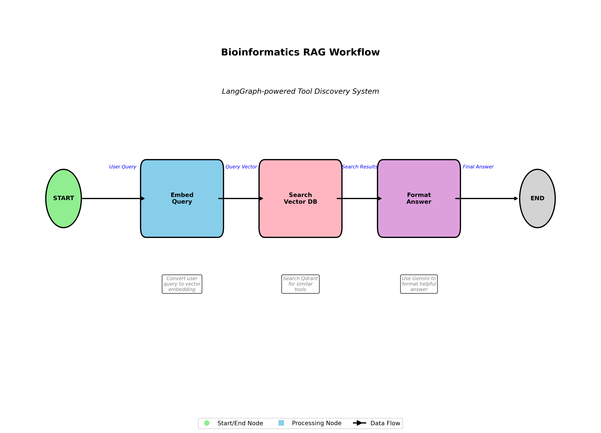

# Semantic Search for Bioinformatics Tools

This repository contains the initial implementation of a semantic search engine designed to help researchers and practitioners find the most fitting bioinformatics tools for their specific needs. While this early version implements a Retrieval-Augmented Generation (RAG) approach using vector databases, future iterations will explore alternative methodologies including Model Context Protocol (MCP) approaches.

## 🎯 Goal

The ultimate goal is to create an intelligent semantic search engine that can understand bioinformatics research queries and recommend the most appropriate tools, databases, and resources. This system aims to bridge the gap between researchers' needs and the vast ecosystem of available bioinformatics tools.

## 📋 Prerequisites

### Dependencies

Before running the code, you need to install the required Python packages. You can install them using pip:

```bash
pip install qdrant-client sentence-transformers python-dotenv langchain langchain-google-genai langgraph
```

**Required packages:**

- `qdrant-client` - For vector database operations
- `sentence-transformers` - For creating embeddings using biomedical models
- `python-dotenv` - For environment variable management
- `langchain` - Core LangChain framework for building LLM applications
- `langchain-google-genai` - For Google Gemini LLM integration
- `langgraph` - For creating the RAG workflow graph

### Environment Variables

Create a `.env` file in the root directory based on the provided `.env.example` file and fill in your credentials:

```bash
# Google API Key for Gemini LLM
GOOGLE_API_KEY=your_google_api_key_here

# Qdrant Vector Database Configuration
QDRANT_CLUSTER_URL=your_qdrant_cluster_url
QDRANT_API_KEY=your_qdrant_api_key
QDRANT_CLUSTER_ID=your_cluster_id

# Database Configuration
COLLECTION_NAME=OmiyDB
EMBEDDING_MODEL=microsoft/BiomedNLP-BiomedBERT-base-uncased-abstract-fulltext
```

**Required environment variables:**

- `GOOGLE_API_KEY`: Your Google API key for accessing Gemini
- `QDRANT_CLUSTER_URL`: URL of your Qdrant cloud cluster
- `QDRANT_API_KEY`: API key for your Qdrant cluster
- `COLLECTION_NAME`: Name of your vector collection (default: OmiyDB)
- `EMBEDDING_MODEL`: The biomedical embedding model to use

## 📁 Repository Structure

### `qdrant_db/` - Vector Database Management

This folder contains scripts for setting up and managing the Qdrant vector database:

- **`create_collection.py`** - Creates a new collection in Qdrant with the appropriate configuration for biomedical embeddings (768 dimensions, cosine distance)
- **`upload_data.py`** - Uploads bioinformatics tool data to the vector database. Currently includes 8 popular tools (BioPython, Bioconductor, BLAST, Clustal Omega, IGV, Galaxy, GATK, Cytoscape) with detailed descriptions
- **`query_data.py`** - Simple testing script that allows you to query the vector database directly and see raw search results

### `rag_system/` - RAG Agent Implementation

This folder contains the core RAG (Retrieval-Augmented Generation) system:

- **`rag_agent.py`** - The main RAG agent implementation using LangGraph. Contains the complete workflow orchestration
- **`rag_utils.py`** - Utility functions for environment validation and connection testing
- **`demo.py`** - **Main entry point** - Interactive demo script to test the system with custom queries
- **`rag_workflow_diagram.png`** - Visual representation of the RAG workflow
- **`rag_example_flow.png`** - Example flow diagram showing the agent in action

## 🔄 RAG Workflow

The RAG system follows a structured workflow as visualized in the diagrams:

<div style="display: flex; gap: 20px; justify-content: center; align-items: center; flex-wrap: wrap;">
  
  
</div>

**Workflow Steps:**

1. **Start** - User provides a bioinformatics query
2. **Embed Query** - Convert the user query into a vector embedding using the biomedical BERT model
3. **Search Vector DB** - Search the Qdrant database for the most relevant bioinformatics tools
4. **Format Answer via LLM** - Use Google Gemini to generate a natural language response based on the retrieved tools

## 🚀 Getting Started

### 1. Set up the Vector Database

First, create the collection and upload data:

```bash
# Create the Qdrant collection
python qdrant_db/create_collection.py

# Upload bioinformatics tools data
python qdrant_db/upload_data.py
```

### 2. Test the Database (Optional)

Verify your setup by testing direct queries:

```bash
python qdrant_db/query_data.py
```

### 3. Run the RAG Demo

**Main entry point** - Once you have a working Qdrant cluster with data:

```bash
python rag_system/demo.py
```

This will start an interactive session where you can ask questions about bioinformatics tools and receive intelligent recommendations.

## 🧪 Example Queries

Try asking questions like:

- "I need to align protein sequences"
- "What tools can I use for variant calling?"
- "I want to visualize genomic data"
- "How can I analyze RNA-seq data?"

## 🔮 Future Development

This repository represents the initial RAG implementation. Future development will include:

- **Model Context Protocol (MCP) approaches** - Alternative methodologies for tool discovery
- **Expanded tool database** - More comprehensive coverage of bioinformatics tools
- **Advanced query understanding** - Better interpretation of complex research needs
- **Integration capabilities** - Direct integration with popular bioinformatics workflows

## 📧 Support

If you encounter issues with setup or have questions about the system, please check:

1. Environment variables are correctly set
2. Qdrant cluster is accessible
3. Google API key has proper permissions
4. All dependencies are installed

The `demo.py` script includes built-in connection testing to help diagnose common issues.
